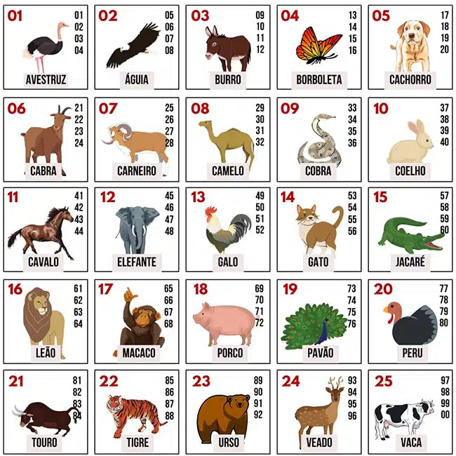

# 🎲 Simulador de Sorteios Baseado em Referência Cultural

Este projeto é um **simulador baseado em um sistema tradicional brasileiro conhecido popularmente como "jogo do bicho"**, utilizado aqui como **referência cultural**.

🚀 **Veja o projeto funcionando online:**  
[Ver Projeto](https://emanuelfelicio.github.io/javascript-projetos-simples/projeto-simulador-de-sorteio/)

O objetivo é praticar e demonstrar habilidades técnicas como:

- Lógica de programação
- Manipulação e categorização de dados
- Geração de números aleatórios
- Simulação de sistemas baseados em regras fixas

> ⚠️ **Aviso Legal**: Este projeto é de natureza **educacional e experimental**.  
> Não possui qualquer vínculo com práticas ilegais ou incentivo à participação em jogos de azar.  
> Trata-se exclusivamente de um estudo técnico com fins didáticos.

---

##  Funcionalidades

O sistema oferece duas formas principais de simulação:

- 🔹 **Sorteio geral aleatório**: Geração de números aleatórios que são automaticamente associados aos respectivos animais.
- 🔹 **Sorteio por animal**: O usuário seleciona um animal, e o sistema gera números aleatórios pertencentes exclusivamente a esse grupo.

---

## 🔢 Lógica da Associação

A associação entre números e animais segue uma regra tradicional baseada nos **dois últimos dígitos da milhar**.  
Cada animal é representado por **quatro números**, totalizando 25 animais e 100 números (00 a 99).

 **Exemplo**:  
Se o número sorteado for `6732`, os dois últimos dígitos (`32`) determinam o animal correspondente.

---

## Tabela de Referência

Abaixo está a imagem com a tabela que associa os números a cada animal (grupo de 4 números por animal):

